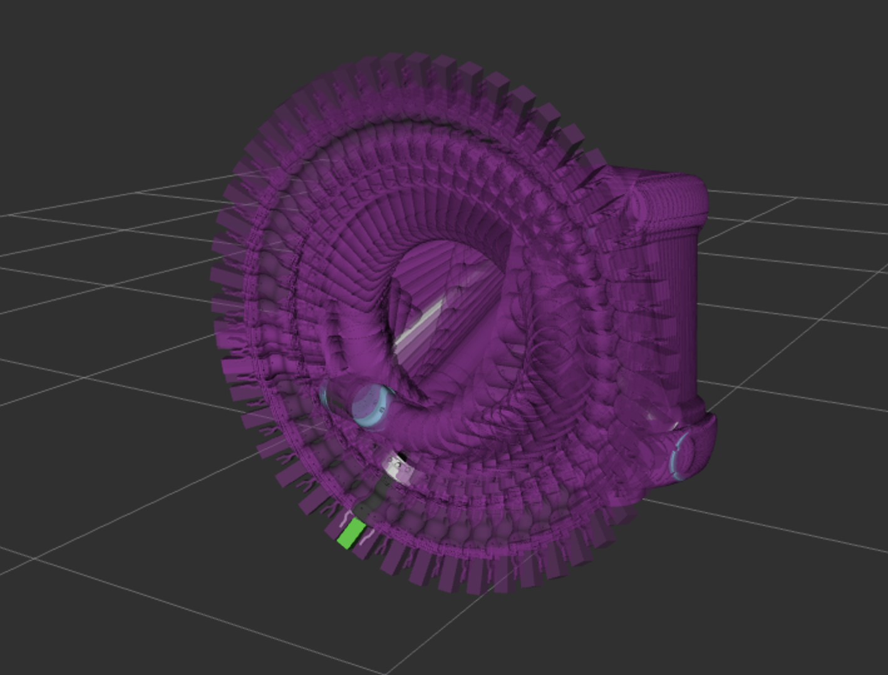
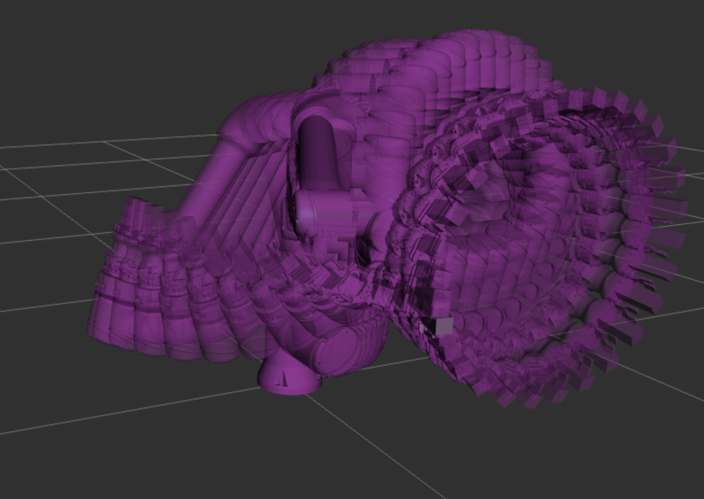

# Railcar Spray Coating Automation — ROS 2 Robotics Workspace

This repository contains the ROS 2 workspace for a collaborative-robot spray coating system developed for the UIUC SE494 Senior Design project, sponsored by Marmon Holdings. The project explores how a UR10e robot arm can automate interior coating of railcar tank heads, a confined-space industrial process that is hazardous, physically demanding, and difficult to perform consistently by hand.

The system combines Universal Robots ROS 2 control, MoveIt 2 motion planning, a Robotiq Hand-E gripper/tool interface, custom URDF tooling, and geometry-driven trajectory generation for curved tank-head surfaces. The main application plans and executes surface-following ring and spiral paths while maintaining a controlled tool orientation and standoff distance from the coating surface.

<p align="center">
  
</p>

<p align="center">
  
  
</p>


## Project overview

Railcar interior coating requires workers to operate spray equipment inside enclosed tank spaces. Manual spraying can expose operators to hazardous environments and can produce uneven coverage on curved end-cap geometry. This project demonstrates a proof-of-concept robotic workflow for moving the spray process toward safer, more repeatable operation.

The repository includes both simulation and real-hardware workflows. In simulation, the UR10e driver runs with fake hardware while MoveIt 2 visualizes and plans robot motion in RViz. On hardware, the workspace connects to a physical UR10e controller and Robotiq Hand-E gripper through the ROS 2 driver stack.

## Technical highlights

- ROS 2 Humble workspace integrating UR robot control, MoveIt 2 planning, and Robotiq Hand-E tooling.
- UR10e simulation workflow using `use_fake_hardware:=true` for development without a physical robot.
- Real-hardware workflow for connecting to a UR controller over Ethernet and commanding the robot through the Universal Robots ROS 2 driver.
- Custom `path_exp` package for generating and executing spray trajectories over railcar tank-head geometry.
- Surface-following ring and spiral trajectory generation using geometric normals, tangents, tool orientation constraints, and Cartesian path planning.
- Custom URDF/tool TCP integration for representing the end effector used by the trajectory planner.
- Gripper/tool IO utilities for testing Robotiq Hand-E and UR digital output behavior.

## Author and project context

Primary ROS/software development by Junyang Guan (jg73@illinois.edu).

Developed by UIUC SE494 Team 14, Fall 2025: Christian F. Belga, William Deng, Sonali Manjunath, Amit J. Mathai, and Junyang Guan.

Project sponsor: Marmon Holdings / UTLX.

Academic advisor: Mike Brunetto.

## What is included

- `src/path_exp/` — project-specific ROS 2 Python package for trajectory generation, MoveIt execution, and gripper/tool tests
- `src/Universal_Robots_ROS2_Driver/` — Universal Robots ROS 2 driver package set (external/third-party package)
- `src/robotiq_hande_driver/` — Robotiq Hand-E gripper ROS 2 controller package (external/third-party package)
- `src/robotiq_hande_description/` — Robotiq Hand-E description and URDF files (external/third-party package)
- `src/ur_description/` — Universal Robots description and URDF resources
- `robot_calibration.yaml` — calibration-related configuration file

## External packages

Several packages in this workspace are incorporated from upstream open-source robotics projects. They are included directly so the repository can be cloned, inspected, and built as a standalone ROS 2 workspace.

External packages include:

- `src/Universal_Robots_ROS2_Driver/`
- `src/robotiq_hande_driver/`
- `src/robotiq_hande_description/`

Team 14 did not author these external packages. The project-specific integration, launch workflow, tool configuration, and trajectory experiments are contained primarily in `src/path_exp/` and the customized robot description files.

## Getting started

### 1. Clone the repository

```bash
git clone https://github.com/lloyd9179/UIUC-SE494-Fall-2025---Team-14.git
cd UIUC-SE494-Fall-2025---Team-14
```

### 2. Install prerequisites

Use Ubuntu 22.04 LTS with ROS 2 Humble and MoveIt 2. Other ROS versions or ROS 2 distributions are not the target environment for this workspace.

Before running any launch files, install the ROS dependencies required by the Universal Robots driver, MoveIt 2, and the Robotiq Hand-E packages. The upstream package READMEs in `src/Universal_Robots_ROS2_Driver/` and `src/robotiq_hande_driver/` contain the full dependency details.

### 3. Build the workspace

This repo is structured as a ROS workspace. From the top level:

```bash
colcon build --symlink-install
source install/setup.bash
```

Whenever source code or package configuration changes, rebuild from the workspace root and source the setup file again:

```bash
colcon build --symlink-install
source install/setup.bash
```

## Simulation-only usage

Use this flow when no physical UR10e or Robotiq gripper is connected. Open three terminal windows. In each terminal, start from the workspace root and source the workspace:

```bash
cd ~/ur_ws3
source install/setup.bash
```

### Terminal 1: start the fake UR robot driver

```bash
ros2 launch ur_robot_driver ur_control.launch.py ur_type:=ur10e use_fake_hardware:=true robot_ip:=0.0.0.0
```

### Terminal 2: start MoveIt 2 and RViz

```bash
ros2 launch ur_moveit_config ur_moveit.launch.py ur_type:=ur10e use_fake_hardware:=true launch_rviz:=true
```

### Terminal 3: run the ring trajectory program

```bash
ros2 run path_exp traj_rings_completed
```

## Real-hardware usage

Use this flow when operating the physical UR10e and Robotiq Hand-E gripper. Confirm that the robot workcell is clear and that the operator can reach the emergency stop before enabling motion.

### Hardware preparation

1. Connect the Ubuntu machine to the UR10e controller over Ethernet.
2. Configure the robot and computer network according to the Universal Robots ROS 2 driver network setup guide.
3. Install and configure the External Control URCap on the UR teach pendant.
4. Do not install the Robotiq Hand-E manufacturer URCap for this workflow. The ROS 2 driver controls the gripper directly, and the gripper URCap can conflict with the ROS hardware interface.
5. Mount and wire the Robotiq Hand-E gripper according to its installation manual.

The commands below assume the robot controller IP address is `192.168.56.101` and the UR tool communication port is `54321`. Change those values if your robot is configured differently.

### Terminal 1: create the gripper serial bridge

```bash
socat pty,link=/tmp/ttyUR,raw,ignoreeof,waitslave tcp:192.168.56.101:54321
```

This creates `/tmp/ttyUR`, a virtual serial port used for Robotiq gripper communication through the UR controller.

### Terminal 2: test the gripper connection

```bash
cd ~/ur_ws3/build/robotiq_hande_driver
./communication_test
```

A successful connection usually activates the gripper and produces mechanical movement or sound. If this test fails, fix the gripper connection before launching the robot driver.

### Terminal 3: start the real UR robot driver

```bash
cd ~/ur_ws3
source install/setup.bash
ros2 launch ur_robot_driver ur_control2.launch.py ur_type:=ur10e use_fake_hardware:=false robot_ip:=192.168.56.101 use_tool_communication:=false create_socat_tty:=false tty_port:=/tmp/ttyUR
```

RViz should open and display the robot model. If red Modbus or gripper communication errors appear, stop this launch, rerun the gripper connection test, and start this terminal again.

### Terminal 4: manually test gripper action control

Close the gripper:

```bash
ros2 action send_goal /gripper_action_controller/gripper_cmd control_msgs/action/GripperCommand "{command: {position: 0.0, max_effort: 20.0}}"
```

Open the gripper:

```bash
ros2 action send_goal /gripper_action_controller/gripper_cmd control_msgs/action/GripperCommand "{command: {position: 0.024, max_effort: 20.0}}"
```

### Terminal 5: start MoveIt 2

```bash
cd ~/ur_ws3
source install/setup.bash
ros2 launch ur_moveit_config ur_moveit.launch.py ur_type:=ur10e use_fake_hardware:=false launch_rviz:=true
```

A second RViz window should appear with the MoveIt planning scene.

### Terminal 6: execute the trajectory program

```bash
cd ~/ur_ws3
source install/setup.bash
ros2 run path_exp traj_rings_completed
```

## Available custom commands

The `path_exp` package installs these ROS 2 executables:

- `spiral_test` — simple MoveIt joint-goal test.
- `spiral_real` — Cartesian spiral trajectory experiment.
- `traj_spiral` — CAD-style spiral trajectory over the tank-head geometry.
- `traj_rings` — concentric ring trajectory experiment.
- `traj_rings_completed` — main ring trajectory sequence with the custom tool TCP.
- `test_gripper` — UR digital IO gripper test through `/io_and_status_controller/set_io`.

If you are not sure which launch files are available, search inside `src/`:

```bash
find src -name '*.launch.py'
```

> Note: The ROS 2 package name is `ur_robot_driver`, not the top-level workspace directory name.

## How to use the packages

### Universal Robots ROS2 Driver

The `src/Universal_Robots_ROS2_Driver/` package contains a complete ROS2 driver for Universal Robots manipulators. It includes:

- `ur_robot_driver`
- `ur_controllers`
- `ur_calibration`
- `ur_bringup`
- `ur_moveit_config`

Follow the package README inside `src/Universal_Robots_ROS2_Driver/README.md` for detailed installation and usage instructions.

### Robotiq Hand-E driver

The `src/robotiq_hande_driver/` package is a ROS2 controller for the Robotiq Hand-E gripper. Its README has quick-start commands and usage examples for both fake-hardware and real hardware modes.

### Robotiq Hand-E description

The `src/robotiq_hande_description/` package provides URDF and mesh resources for the gripper. It is intended to be used together with `robotiq_hande_driver`.

## Supporting documentation

- Universal Robots ROS 2 documentation: https://docs.universal-robots.com/Universal_Robots_ROS2_Documentation/index.html
- Universal Robots ROS 2 driver source: https://github.com/UniversalRobots/Universal_Robots_ROS2_Driver/tree/humble
- Robotiq Hand-E driver README: `src/robotiq_hande_driver/README.md`
- MoveIt tutorials: https://moveit.picknik.ai/main/doc/tutorials/tutorials.html

## License

This project is licensed under the MIT License. See `LICENSE` for details.

## Notes

- If you want GitHub to display package contents normally, remove nested `.git` folders or use proper submodules.
- If the repository is intended to be a standalone workspace, keeping the package content tracked directly is usually the best approach.
- If the package directories are shared across multiple repositories, then submodules are the more appropriate solution.
- The repository includes external packages from other authors, which are incorporated here as normal source directories for browsing and building. Team 14 did not author those external packages.
